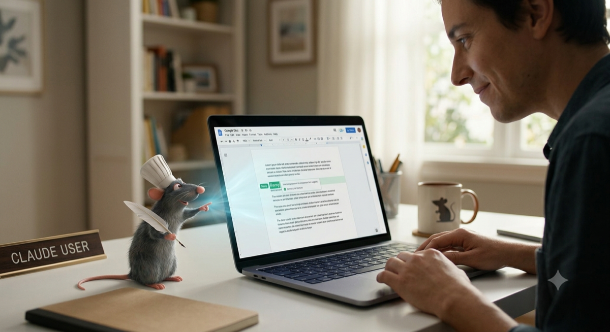
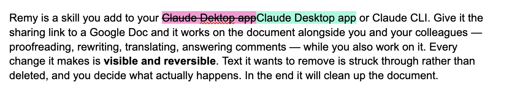

# Remy V0.4 (beta) 🐀

*The invisible sous-chef for Google Docs.*

## If you and your team use Google Docs for collaborative writing, then Remy makes Claude your interactive co-author!



Working on a shared Google Doc together with others using Claude
Code/Cowork/Chat is cumbersome with the standard skills. With **Remy**
(remember the skilled rat from Ratatouille that invisibly guides the chef's
hands?) Claude becomes a fully capable collaborator that co-authors your
document.

Remy is a skill you add to your Claude Desktop app or Claude CLI. Give it
the sharing link to a Google Doc and it works on the document alongside you
and your colleagues — proofreading, rewriting, translating, answering
comments — while you also work on it. Every change it makes is **visible and
reversible**. Text it wants to remove is struck through rather than deleted,
and you decide what actually happens. In the end it will clean up the
document.

This is what it looks like (Remy has corrected a typo):



Note: Google's APIs do not support native "suggestions" yet. It is in beta,
email [remy@dirkpaessler.com](mailto:remy@dirkpaessler.com) to become a beta
tester.

## Minimizes AI's blast-radius through a minimalistic security concept

Remy is not using your Google account so it has no access to all your other
data, you will create a "service account" for him. To get started you only
give Remy a shared document URL and it can only access that file. You are
not handing over all your data to the AI!

# Getting started

What you need:

- The **Claude Desktop App** or **Claude CLI** on your Mac or Windows (on
  Windows only in Code, and so far untested)
- (Note: Remy does not work on claude.ai in a browser, or in the mobile
  apps).
- A **Google account** — the ordinary one you already use for documents.

## 1. Install Remy

In the **Claude app**, go to **Code**, start a new session, and paste this
prompt:

```
Install the Remy plugin for me: run "claude plugin marketplace add
dirkpaessler/remy" and then "claude plugin install remy@remy-marketplace";
after that, find the installed plugin's remy.py and run its install-mcp
command so Chat and Cowork are covered too (install uv first if it is
missing). If claude is not on the PATH, use the CLI bundled inside the
desktop app.
```

Claude runs the installation and tells you when it is done. Then **quit and
reopen the Claude app once (⌘Q)**. The first time Remy acts in Chat or
Cowork, the app asks for permission once (*"Claude wants to use … from
remy"*). That is the standard question for any connector; Remy runs entirely
on your own computer, so allowing it — including *"Always allow"* — is fine.

*Tips: Installation only works in the Code window. Once installed, Remy
works in Code, Chat and Cowork alike — the app bridges even cloud Cowork
tasks to your Mac. Remy will tell you if there are new versions. Once a
day it asks GitHub whether a newer version exists; GitHub's public
download counter thereby doubles as an anonymous count of active
installations. Nothing about you or your documents is ever sent, and
`REMY_NO_UPDATE_CHECK=1` switches the check off.*

## 2. Share the document

Open your Google Doc, click **Share**, and under *General access* choose
**Anyone with the link**. Set it to **Editor**.

Then paste the link into Claude and say what you want in the same breath:

```
https://docs.google.com/document/d/… — please fix the typos and shorten the
introduction by about a third
```

Remy reads the document, does the work, and reports what it changed. From
there you simply keep talking about the document and your desired changes.

## 3. But first: Remy needs a personality

Remy needs a "service account" (think of it as a "bot account"). When you
ask Remy to work on a GoogleDoc for the first time it will guide you through
the setup of the account.

It will open an online terminal (a black box which you do not need to
understand) that will ask for your Google account. Then Remy will ask you to
paste one line of text and hit enter. After about a minute a file called
`remy-key.json` downloads.

Then say `"Remy, I downloaded the key file"` and Claude finds it, checks
that Google accepts it, and puts it where it belongs.

*Tips: This account is a small robot account of its own, called a service
account. It has an empty Google Drive, it can only see documents you have
shared by link, and it never touches your personal Google account. Each
person sets up their own robot account — the key file is a secret and not
meant to be passed around.*

## 4. What Remy's changes look like

Open the document in your browser and you will see two colours.


The struck-out words are still there. Remy does not delete anything before
you give your ok; it shows you what it would remove and waits. Colleagues
can keep reading the document normally in the meantime.

## 5. Things you can say

There are no commands to memorise. Describe what you want the way you would
to a colleague (just a few suggestions, it's an LLM, it can do so much
more!).

- **`Replace every "client" with "partner"`**: changed everywhere in one pass
- **`Find the statistics jargon and rewrite it for normal people`**: each
  passage marked up
- **`Shorten the introduction by 40%`**: a tighter version proposed beside
  the original
- **`Build a reference list from the citations in the text`**: citations
  will be collected and added
- **`Renumber figures including all references`**: find all figures and
  renumber them
- **`Answer the open comments`**: replies to your colleagues and resolves
  the threads
- **`Put this picture after the introduction: https://…`**: inserts a
  picture from any public web address

## 6. Leaving notes for Remy inside the document

Anyone working on the document can leave Remy an instruction without opening
Claude at all: start a line, or a comment, with the tag `@@remy`. A line in
the text that reads `"@@remy translate this paragraph into German"`, or a
comment saying `"@@remy make this section shorter"`, is an instruction Remy
will find.

Next time you ask Remy to look at the document it finds these, carries them
out, and strikes the note through so the same job is never done twice. It is
a good way to collect work while you read, and a good way for colleagues who
don't use Claude to ask for something.

## 7. When you are finished

Remy asks what should happen to its changes. You can also just say it
yourself, at any time, even days later:

**`Remy, accept the changes`** — struck-out text goes, the colours vanish,
the new wording stays as ordinary text.

**`Remy, undo the changes`** — everything Remy added disappears and the
struck-out text comes back. The document returns exactly to how it was. If
you would rather go through them one at a time, just clear the highlighting
by hand as you accept each one. Remy does not mind either way.

## If something goes wrong

**Claude says it can only read the document.** The sharing link of the
GoogleDoc is set to *Viewer*. Check the Share settings.

**Remy writes comments instead of marking up the text.** The link is set to
*Commenter*. Change it to *Editor* to have changes shown in the text itself.

**Claude cannot find the key file.** Tell it where you put it — *"it's on my
Desktop"* — or drag the file into the chat window.

**Remy writes in the wrong language.** It shouldn't: it writes in the
language of the document, not of your conversation, and refuses mismatches.
If you deliberately want a translation, say so.

## What Remy cannot do

- **Upload a picture from your computer:** Remy can place a picture that is
  already somewhere on the web (give it the address) because Google fetches
  it from there. It has no storage of its own, which is also why it cannot
  draw a chart from your data: there would be nowhere to put the image. If
  you ask anyway, it leaves a comment describing what belongs there.
- **Anchor its comments to a sentence:** Comments made through the API land
  in the document's general comment list, not pinned to the text. Google
  allows nothing else by this route, which is why the important work is
  shown as coloured text instead.

# No guarantees, no liability

Remy is open source, given away for free under the MIT licence, in the hope
that it is useful. It comes as is: no warranty of any kind, no guarantees,
and no liability — you use it at your own risk, and what happens in your
documents is your responsibility. The design keeps that risk small: every
change is visible and reversible, and Google Docs keeps a full version
history. Still, read Remy's changes before accepting them, the way you would
read a colleague's — it is good, it is fast, and it is occasionally
confident about something that is wrong.

# For developers

## How it works

Everything goes through one deterministic CLI,
`skills/remy/scripts/remy.py`. The model decides *what* to say; the code
decides *how* it reaches the document.

- **Write mode** — suggestions where genuinely available, otherwise markup,
  otherwise comments. Established by probing the API, never by trusting a
  flag.
- **Language** — `suggest` refuses text whose detected language differs from
  the document's, so a German summary cannot land in an English manuscript.
- **The right view** — documents are read with collaborators' suggestions
  applied; write indices come from the raw view.
- **No duplicate work** — an executed `@@remy` command is struck through,
  and the scanner skips struck or marker-closed tags.
- **One-call briefing** — `session` returns access, mode, language, outline,
  tasks, existing markup and next steps together.
- **Fixed wording** — `finish` returns the exact question to put to the
  user.

`remy_mcp.py` is a thin wrapper that loads `remy.py` and exposes the same
functions as MCP tools, so Chat and Cowork share one implementation with
Claude Code rather than getting a second one.

See [`SKILL.md`](skills/remy/SKILL.md) for the command reference and
[`SETUP.md`](skills/remy/references/SETUP.md) for the manual account path.

## Tests

```bash
python3 skills/remy/tests/test_remy.py
```

62 tests, no network, no credentials, no dependencies. They cover what is
expensive to get wrong: that `remy.py` carries no preview API surface,
UTF-16 index arithmetic, anchor disambiguation, the language guard, that the
markup colours collide with none of the 81 swatches in the Google Docs
picker, the picture-markup arithmetic and its accept/reject resolution, that
a closed `@@remy` tag is never reported twice, and that the docs still
describe the CLI, colours, version, test count and bundled MCP server that
actually exist.

## Why the blast radius is small

Remy's service account is its own empty Google account. It can only touch
documents already shared by link, and only as far as that link allows. It
cannot see your Drive, your mail, or anything else.

## About real suggestions

Remy can produce genuine Google Docs suggestions — tracked changes with
Accept/Reject buttons, working even on a comment-only link. But: That code
is not in this build. Yet. Google doesn't allow this until the API features
are public. Yet.

`writeMode: SUGGEST` entered the [Workspace Developer
Preview](https://developers.google.com/workspace/preview) on 7 July 2026. It
is not generally available, and the terms are explicit: preview features may
not be included in public applications, nor exposed to users outside your
own company. So the code is *absent*, not disabled — verifiable by reading
`remy.py`, and enforced by a test. Remy loads an optional `preview.py`
module where one exists; enrolled organisations keep it in an internal
build.

Two things make this more than caution:

- The API lies when you are not enrolled. It accepts `writeMode: SUGGEST`
  without error and then edits the document directly, while reporting a
  suggestion.
- Without enrolment a commenting link cannot be written to at all, which is
  why markup mode needs an editing link.

## Licence

MIT — see [LICENSE](LICENSE).
